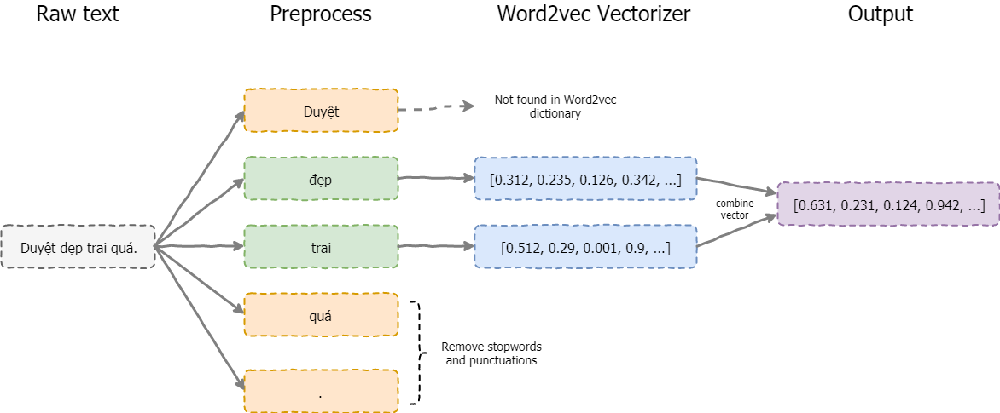
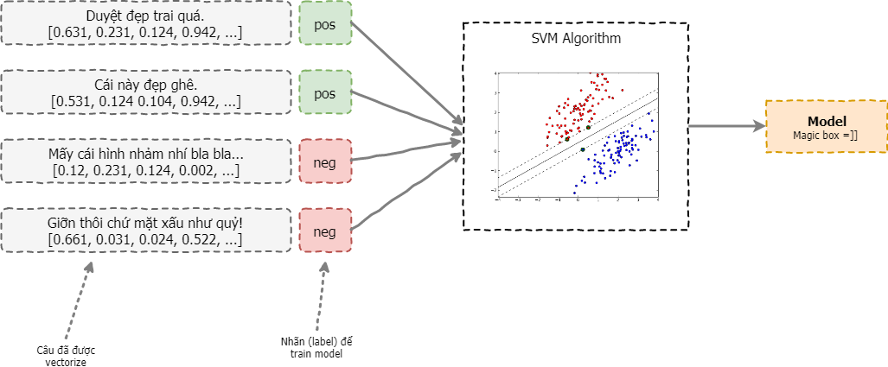
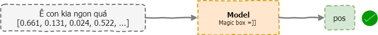

# SVM-Word2vec
SVM Classification with Word2vec

Trong Notebook này mình sử sử dụng SVM để phân lớp sentiment (cảm xúc) cho các văn bản. 

Bằng cách sử dụng 1 tập văn bản đã được gán nhãn sắn. Mỗi câu được vector hóa sử dụng Word2vec (xem lại bài viết Word2vec). Được minh họa như hình bên dưới. 



Các bước sẽ thực hiện:
1. Vector hóa từng câu văn bản:
    + Tách từ cho từng câu. (E.g. `"Duyệt đẹp trai quá"` ==> [ `"Duyệt"`, `"đẹp"`, `"trai"`, `"quá"` ]
    + Lọc bỏ stopwords (e.g. [ `"Duyệt"`, `"đẹp"`, `"trai"`, `"quá"` ] ==> [ `"Duyệt"`, `"đẹp"`, `"trai"` ]
    + Dùng Word2vec model (retrain) để biến mỗi từ thành 1 vector:
      ```
          "đẹp" => [0.1123, 0.234, 0.256, 0.001, ...]
          "train" => [0.542, 0.124, 0.232, 0.124, ...]
      ```
      Các vector này có số chiều cố định và giống nhau (phụ thuộc vào mô hình word2vec).
    + Cộng (hoặc trung bình) các vector của từng từ trong một câu lại, ta được vector của một câu. Cách này khá đơn giản và chỉ dùng được khi câu ngắn (như 1 đoạn tweet). Với câu dài hơn cách biểu diễn này không còn chính xác nữa. Để khắc phục đặc điểm này Doc2vec ra đời. 
    ```
    vec([ "Duyệt", "đẹp", "trai" ]) = [0.1123, 0.234, 0.256, 0.001, ...] + [0.542, 0.124, 0.232, 0.124, ...] + ...
                                     = [0.3421, 0.724, 0.242, 0.364, ...]
    ```
2. Train model SVM
3. Test accuracy

Từ các câu ở bước 1, qua mô hình ta có được mô hình phân lớp:



Từ model này, ta có thể dễ dàng tìm được sentiment của các vector văn bản khác, độ chính xác model phụ thuộc vào nhiều yếu tố (số lượng văn bản training, tham số, ...), độ chính xác này có thể đo được thông qua các độ đo, bằng cách sử dụng tập văn bản test (đã biết trước nhãn) đi qua model của chúng ta. Đây cũng là các bước cơ bản mà Machine Learning với NLP thực hiện.

